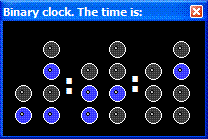



## BinaryClock

### Description

' Just a binary clock showing the current time...

' Funny to show to others who don't understand binary. Just tell them the time shown.

' They will ask you: How the hell do you know? :)

' I got the idea from a real desk binary clock available at geeks.com online store.

' Project time: 10mins
 
### More Info
 

             |
---                |---
**Submitted On**   |2005-12-14 10:40:22
**By**             |[Filipe Lage](https://github.com/Planet-Source-Code/PSCIndex/blob/master/ByAuthor/filipe-lage.md)
**Level**          |Beginner
**User Rating**    |4.0 (8 globes from 2 users)
**Compatibility**  |VB 6\.0
**Category**       |[Jokes/ Humor](https://github.com/Planet-Source-Code/PSCIndex/blob/master/ByCategory/jokes-humor__1-40.md)
**World**          |[Visual Basic](https://github.com/Planet-Source-Code/PSCIndex/blob/master/ByWorld/visual-basic.md)
**Archive File**   |[BinaryCloc19564412142005\.zip](https://github.com/Planet-Source-Code/filipe-lage-binaryclock__1-63645/archive/master.zip)

